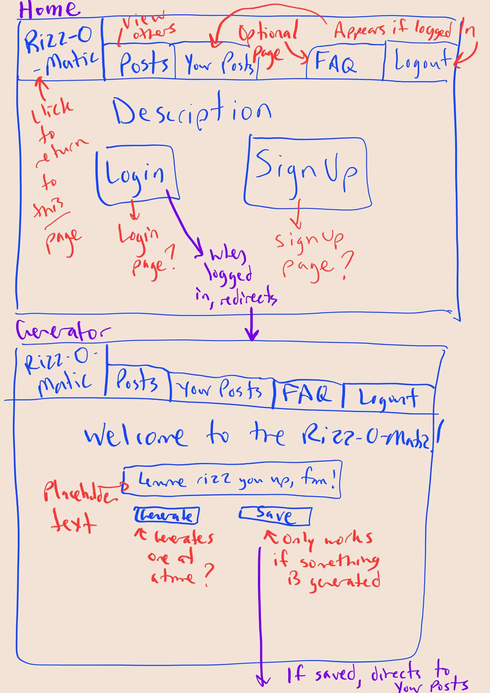
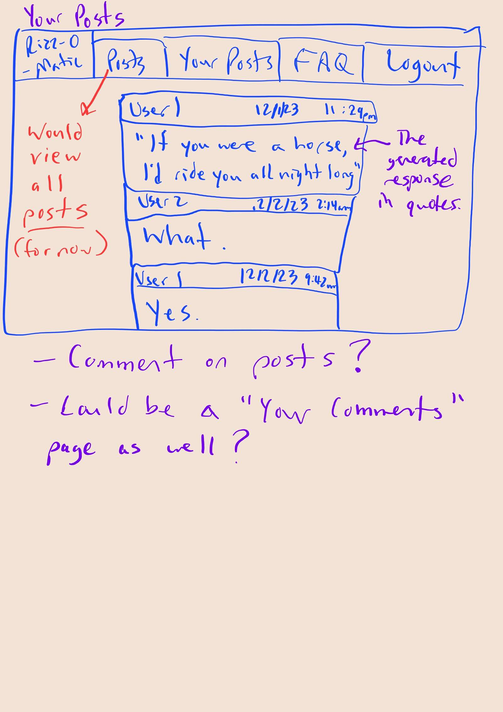
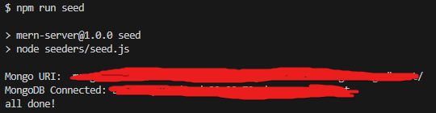
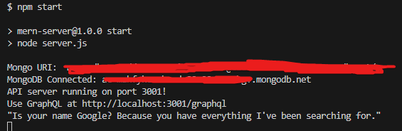
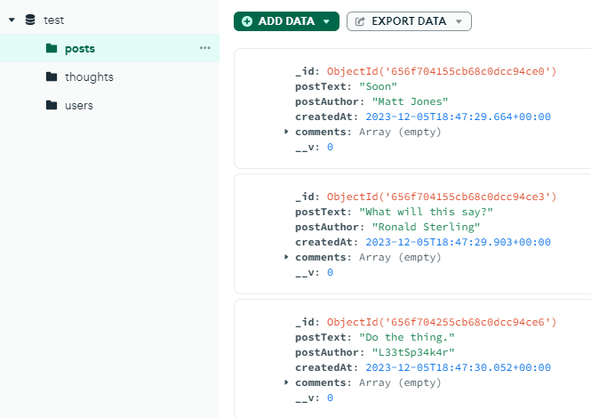
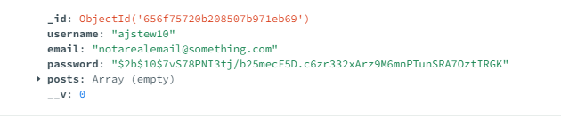
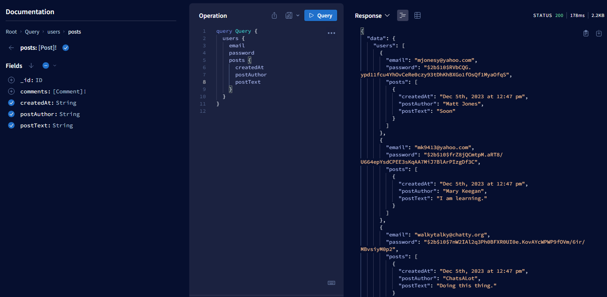
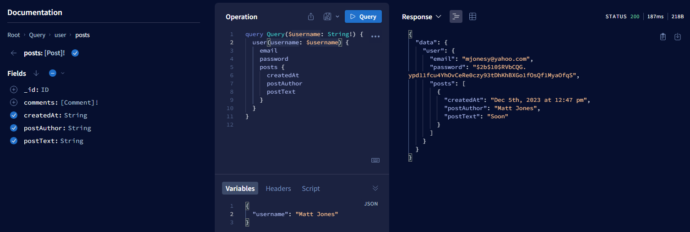

# Rizz-o-matic

## Badge
[]
 

## Table of Contents
- [Description](#description)
- [Screenshots](#screenshots)
- [Usage](#usage)
- [What We Have Learned](#what-we-have-learned)
- [Credits](#credits)
- [Licenses](#licenses)
 

## Description
A "rizz" generator where users can save a silly quote, post it,  
and comment on. Created with MERN architecture, Bootstap CSS,  
and uploaded to Heroku.  

## Screenshots
---Starter Wireframes---  

 

---Testing MongoDB---  
Seeding and connecting through the terminal:  

 

Seeing the new seeds on MongoDB:  

 

Added new user from signup page:  

 

---Testing GraphQL---  

 

---More to be added later---  
-Website homepage  
-Website generator  

## Usage
Simply click on the link and watch the magic happen.    
Link to the website: ---  

## What We Have Learned
---Insert stuff here---

## Credits
Made by  
Luis Monroy: https://github.com/Lou2362  
Laith Khireiwish: https://github.com/vincula1  
Allie Stewart: https://github.com/AllieStewart  
 

## Licenses
Please refer to the LICENSE in the repository.  
