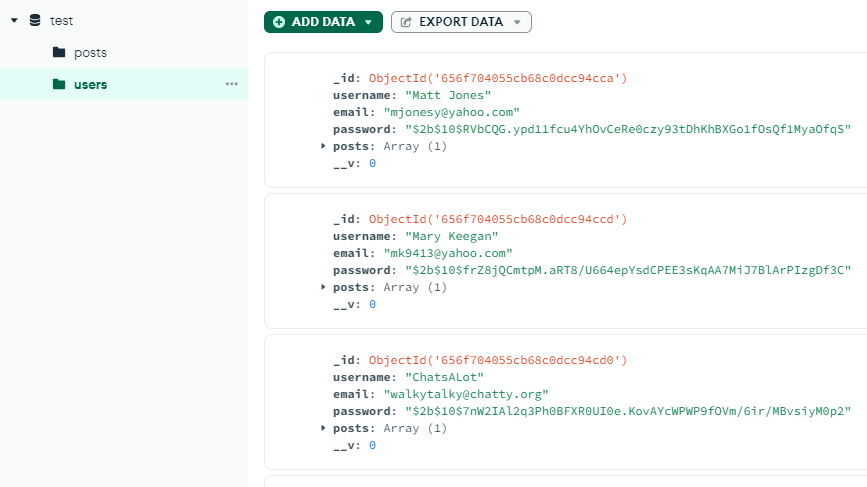

# Rizz-o-matic

## Badges

## Table of Contents
- [Description](#description)
- [Technologies](#technologies)
- [Installation](#installation)
- [Screenshots](#screenshots)
- [Usage](#usage)
- [What We Have Learned](#what-we-have-learned)
- [Future Development](#future-development)
- [Credits](#credits)
- [Licenses](#licenses)
 

## Description
Welcome to the Rizz-O-Matic! It is a "rizz" generator where users can save a silly quote, post it,  
and comment on. Created with MERN architecture, Bootstap CSS, and uploaded to Heroku.  
Info is saved and loaded from MongoDB, and ChatGPT is integrated as the generator.  

## Technologies
Front-End:  
    - React JS  
    - Vite  
    - Bootstrap 5 CSS  
    - CSS  
    - tsParticles  

Back-End:  
    - MongoDB  
    - Express.js  
    - Node.js  
    - ApolloServer/GraphQL  
    - ChatGPT API (openAI)  

## Installation
How to install:

1. **First, clone the repository to your local machine using Git**  
git clone [repository URL](https://github.com/AllieStewart/Rizz-o-matic)

2. **Navigate into the project directory.**  
cd Rizz-o-matic

3. **Install dependencies.**  
npm install

4. **Seed the database.**  
npm run seed

5. **Run the Application.**  
npm run dev

## Screenshots
---Starter Wireframes---  

 

---Testing MongoDB---  
Seeding and connecting through the terminal:  

 

Seeing the new seeds on MongoDB:  

 

Added new user from signup page:  

 

---Testing GraphQL---  

 

 

---Website Home---  

 
(Top of Home)  

 
(Bottom of Home)  

 

---Login---  

 

---Signup---  

 

---FAQ---  

 

---Logged in - Rizz Generator---  

 
(Rizz Generator)  

 

---Viewing Profile---  

 

## Usage
Simply click on the link and watch the magic happen.    
Link to the website: https://rizz-o-matic-proj3-f61a0e80f0f7.herokuapp.com.  

## What We Have Learned
We learned a lot about incorporating a MERN architecture into a group project scenario.  
Configuring MongoDB to connect through both front-end and back-end, along with GraphQL  
and our ChatGPT API, was a process. Express.js and Node.js are known fairly well by this point.  
React was exciting to utilize in new ways, such as implementing background particles through tsParticles,  
and adding a typing animation for the 'rizz generator' for a cool effect.  
Heroku was finnicky about code order, build packs, and attaching dynos, but  
it was eventually figured out with a lot of testing, rewriting, and repeating,  
until the project finally worked in a web environment.  

## Future Development
Though we only had a week for development, and only two of us working on this project,  
several ideas floated around about what we could improve on in the future.  
We could expand the scope of the 'rizz' generator to other possible generators,  
such as dating tips. We could incorporate sharing capabilities with social media platforms  
for users to directly post/share their generated quotes. An on-site chat or friends list  
could make the website more community-focused. We could adapt the site to be more  
mobile-friendly, make it an app to access instead.  

## Credits
---Made by---  
Laith Khireiwish: https://github.com/vincula1  
Allie Stewart: https://github.com/AllieStewart  

---Sources---  
SVG that displays in the browser tab is from https://www.svgrepo.com/svg/374033/razzle.  

"Rizz-O-Matic" logo that displays on the top left of all pages is from  
https://logo.com/ with Vollkorn font and a gold metallic gradient.  

TsParticles background is from https://getisotope.com/post/react-animated-background.  

---Thanks---  
Huge thanks to Diem Ly, one of our amazing  
TAs, and Leah Nelson (https://github.com/LeahNelson), our professor,  
both from the University of Texas Coding Bootcamp program for fall 2023!  
They provided so much assistance in getting our website to  
launch on Heroku, and without them, we would never have been  
able to get the Rizz-O-Matic up and running.  
Especially Diem, who came up with the idea in the first place  
for us to implement, and worked with us for 4 hours straight  
on the last class day. ❤️  

## Licenses
Please refer to the LICENSE in the repository.  